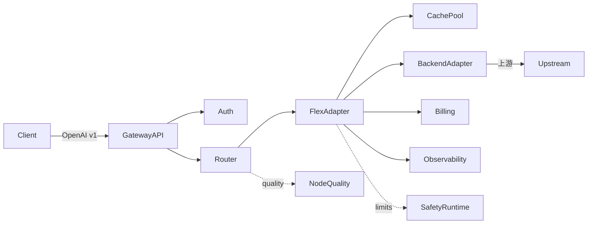

# 总体架构

> [← 返回文档中心](README.md) ｜ [下一步：Gateway API →](gateway-api.md)

本节描述 PLocalSwitch 的整体架构、启动流程、请求生命周期与 10 大核心模块划分。

---

## 1. 设计定位

- **形态**：本地/自部署的 **LLM API 代理网关**，附赠一个 Tauri 桌面管理壳（前端管理界面）。
- **核心转换**：对外以 **OpenAI v1 为统一契约**（主入口 `/v1/chat/completions`、`/v1/models`、`/v1/embeddings`），内部把请求**双向转换**到各类上游协议（Anthropic / Gemini / Ollama / 百度千帆 / DashScope / 星火 / 混元 / Bedrock / Cohere / vLLM / TGI / 任意 OpenAI 兼容中转），客户端零改动接入。
- **兼容层**：额外支持 Anthropic / Gemini / Ollama 客户端用原生协议直接接入（`/v1/messages`、`/gemini/v1beta/models/{model}:generateContent`、`/api/chat`），网关嗅探协议后归一化到同一管线，再按入站协议回显，便于工具/生态直接对接。
- **边界(不做)**：不做 LLM 推理、不实现 Agent、不持久化会话内容、不替代业务后端。

---

## 2. 技术栈

| 层 | 技术 |
|---|---|
| 语言 | Rust (edition 2021, MSRV 1.76) |
| 异步运行时 | tokio (`rt-multi-thread` + `full`) |
| Web 框架 | axum 0.7 + tower / tower-http |
| HTTP 客户端 | reqwest 0.12（独立连接池，rustls，支持 socks） |
| 序列化 | serde + serde_json（`preserve_order` / `arbitrary_precision`）+ serde_yaml |
| 数据库 | sqlx（默认 sqlite，可切 postgres） |
| 缓存池 | mini-moka（LRU + TTL 混合淘汰） |
| 可观测 | tracing / tracing-subscriber + prometheus |
| 分词/计费 | tiktoken-rs |
| 桌面壳 | Tauri 2（tray / dialog / fs / notification） |

---

## 3. 10 大核心模块

后端源码在 `src-tauri/src/`，每个模块独立 `pub mod`，解耦可替换。

| # | 模块 | 作用 |
|---|---|---|
| 1 | [`gateway_api`](gateway-api.md) | 对外 OpenAI v1 兼容接口 + 内部管理接口 + Prometheus |
| 2 | [`router`](router.md) | 模型别名 → 真实模型 → 节点组，权重/主备/降级路由 |
| 3 | [`flex_adapter`](flex-adapter.md) | 柔性适配核心：能力缓存、参数改写、协议嗅探、宽容解析、重试控制、故障研判 |
| 4 | [`backend_adapters`](backend-adapters.md) | 13 类厂商硬编码适配器（OpenAI/Anthropic/Gemini/Responses/Ollama/…） |
| 5 | [`cache_pool`](cache-pool.md) | LRU-TTL 独立缓存池（流式/非流式双实例，内存双上限） |
| 6 | [`billing`](billing.md) | 双账本计费（上游真实成本 / 客户端计费）+ 分词器对账 |
| 7 | [`node_quality`](node-quality.md) | 节点质量打分（0-100）、样本阈值保护、自动降权摘除 |
| 8 | [`observability`](observability.md) | Trace 全局 ID、SubAttempt 链路、脱敏、Prometheus 指标 |
| 9 | [`safety_runtime`](safety-runtime.md) | 并发上限、超时隔离、每节点连接池、背压、优雅关闭 |
| 10 | [`optional_components`](optional-components.md) | 可选：Redis 缓存替换 / WebUI 静态 / LDAP 认证 / Webhook 告警 |

另有辅助模块：`config`(AppConfig)、`models`(数据模型)、`state`(全局托管)、`error`、`logging`、`services`(桌面壳业务)、`commands`(IPC)。

---

## 4. 启动流程（`lib.rs`）

```
1. 打印启动横幅（ASCII + 校验 logo.png 路径）
2. 加载 config/gateway.yaml  →  AppConfig（ArcSwap 支持运行时热更新）
3. 初始化 DB 连接池（sqlite/postgres；双账本 + trace + 对账 建表）
4. 初始化 safety_runtime（并发 Semaphore、reqwest 连接池组、限流器）
5. 启动 cache_pool 后台淘汰任务
6. 启动 capability_cache 后台节点探测任务
7. 启动 node_quality 后台打分任务
8. 启动 gateway_api axum 服务（OpenAI v1 + 管理接口 + /metrics）
9.（仅 desktop-shell）启动 Tauri 桌面窗口 + 托盘管理 UI
```

两种发布形态：

- **桌面版（默认 feature `desktop-shell`）**：Tauri 窗口 + 管理 UI + 网关同进程。
- **纯网关服务器（`--no-default-features --features gateway-server`）**：只跑 axum 网关，无桌面，适合服务器部署。

---

## 5. 请求生命周期（非流式）



以一次 `POST /v1/chat/completions` 为例：

1. **Auth**：校验网关自有 API Key，前置限流（RPM/TPM）、余额、最大并发。
2. **Router**：解析 `model` 别名 → 真实模型 + 目标节点组；结合 [node_quality](node-quality.md) 得分排序候选节点。
3. **FlexAdapter**（[详见](flex-adapter.md)）：
   - 查能力缓存 → 参数改写（删不支持字段/截断 max_tokens/降级 response_format）
   - 对每个候选节点按协议顺序尝试（仅非流式允许试探）
   - 协议嗅探、宽容解析、失败研判、重试控制（`global_max_sub_attempts` 硬上限）
4. **CachePool**：非流式命中则直接返回（不串下游），是否计费按配置。
5. **BackendAdapter**：根据协议把 OpenAI 请求翻译成上游格式，并翻译响应/SSE 回 OpenAI。
6. **Billing**：写双账本（上游 + 客户端），分词器对账。
7. **Observability**：生成 `trace_id` / `sub_attempt_id`，敏感字段经脱敏后入库。

**关键安全约束**：流式一旦向客户端吐过任意 chunk，就**锁死当前协议/节点**，禁止重试/回退/重新试探（避免客户端收到半截流后又被拼接到不同的上游）。

---

## 6. 错误处理与脱敏

- 所有对外错误统一经 [`error_resp`](gateway-api.md#错误响应) 映射为 OpenAI 标准 `{error:{message,type,code}}`。
- 状态码与错误体严格一致（避免出现 503 却带 `internal_error` 的矛盾）。
- 上游地址、Token 在日志/trace/错误报文**一律脱敏**，只给客户端“标签级”安全消息。

---

## 7. 相关文档

- [Gateway API](gateway-api.md) — 对外接口
- [Flex Adapter](flex-adapter.md) — 柔性适配核心
- [Configuration](configuration.md) — 配置详解
- [Getting Started](getting-started.md) — 快速开始
